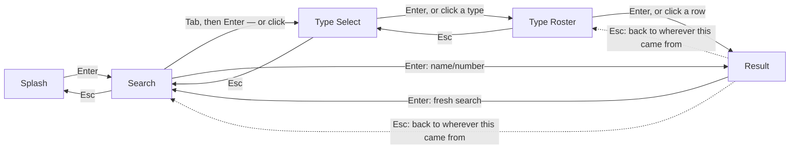

#  pokedex-go 

[](https://github.com/leekli/pokedex-go/actions/workflows/ci.yml)


A terminal Pokédex. Launch it, press Enter, then either type a Pokémon's
name or National Dex Number, or browse by type, and see its sprite and
stats rendered in your terminal, styled after the Pokédex screens from the
Generation 1 Game Boy games.

Built in Go with [Bubble Tea](https://github.com/charmbracelet/bubbletea),
backed by the public [PokeAPI](https://pokeapi.co/).

For the project's vocabulary (Splash Screen, Search Screen, Type Select
Screen, Type Roster Screen, Result Screen, National Dex Number, Lookup
Error vs. Service Error, etc.), see [CONTEXT.md](./CONTEXT.md).


> [!NOTE]
> This project is built using `Claude Code`. This is a project to aid my own learning of using Agentic AI tooling 🤖

## Features

- **Splash Screen** — a hand-crafted ASCII/ANSI "POKEDEX" logo, embedded in
  the binary.
- **Search by name or number** — type a Pokémon's name (`pikachu`, `Mr Mime`,
  `farfetch'd`, `nidoran♀`) or its National Dex Number (`25`). Input is
  normalized automatically to match PokeAPI's expected format.
- **Search by Type** — a button beneath the search box opens the Type
  Select Screen: all 18 Pokémon types, color-coded the same way as the
  Result Screen's type badges. Picking one opens its Type Roster Screen — a
  scrollable table of every real Pokémon of that type, in National Dex
  Number order, with its generation where known — and selecting a row opens
  that Pokémon's Result Screen, same as a direct name/number search.
- **Result Screen** — the Pokémon's front and back sprites side by side,
  rendered as colored terminal block art, plus a Gen-1-styled stat block:
  Pokédex #, name, type badges (color-coded per type), height and weight in
  imperial units (matching the original English games), and base stats (HP,
  Attack, Defense, Sp. Atk, Sp. Def, Speed).
- **Evolution Chain** — a breadcrumb of the Pokémon's family (e.g. Pichu →
  Pikachu → Raichu), the currently-viewed one highlighted, with each
  transition's condition shown beneath it (level, item, friendship, trade,
  ...); a branch (Eevee's evolutions) shows every sibling.
- **Pokédex Entry** — the classic Pokédex description text, preferring a
  Generation I game version (Red, Blue, then Yellow) to match the app's
  styling elsewhere.
- **Weaknesses & Resistances** — every type that deals super effective, not
  very effective, or no damage to this Pokémon, color-coded the same way as
  its type badges.
- **Keyboard and mouse** — every screen is fully keyboard-driven, and where
  your terminal reports mouse events, the same actions (clicking the Search
  by Type button, a type, a Pokémon row, or scrolling the roster) work with
  the mouse too — never one or the other.
- **Distinct error handling** — a bad or unknown name/number shows a
  _Lookup Error_ inline; a PokeAPI outage or timeout shows a distinguishable
  _Service Error_ instead, so you know whether retrying will help.
- **Graceful color degradation** — colors automatically adapt to your
  terminal's capabilities (truecolor, 256-color, or none).

## Controls

| Screen      | Keys                                                                                                                          |
| ----------- | ----------------------------------------------------------------------------------------------------------------------------- |
| Splash      | <kbd>Enter</kbd> search · <kbd>Q</kbd> / <kbd>ESC</kbd> / <kbd>CTRL + C</kbd> quit                                            |
| Search      | <kbd>Enter</kbd> search · <kbd>Tab</kbd> switch to the Search by Type button · <kbd>ESC</kbd> back · <kbd>CTRL + C</kbd> quit |
| Type Select | <kbd>↑/↓</kbd> browse · <kbd>Enter</kbd> select a type · <kbd>ESC</kbd> back · <kbd>CTRL + C</kbd> quit                       |
| Type Roster | <kbd>↑/↓</kbd> scroll · <kbd>Enter</kbd> select a Pokémon · <kbd>ESC</kbd> back · <kbd>CTRL + C</kbd> quit                    |
| Result      | <kbd>Enter</kbd> search again · <kbd>ESC</kbd> back · <kbd>Q</kbd> / <kbd>CTRL + C</kbd> quit                                 |

Mouse: click the Search by Type button, click a type or a Pokémon row, and
scroll the wheel on the Type Roster's table — all work wherever your
terminal reports mouse events.

(On the Search Screen, only <kbd>CTRL + C</kbd> quits — a bare <kbd>Q</kbd> stays typeable, since
plenty of Pokémon names contain it, e.g. Squirtle. On the Result Screen,
<kbd>ESC</kbd> returns to wherever you came from — the Search Screen, or the Type
Roster Screen if that's how you got here — while <kbd>Enter</kbd> always starts a
fresh search; see [Architecture](#architecture).)

## Requirements

- Go 1.26 or later (matches the `.devcontainer` image)
- Network access to `pokeapi.co` to look up Pokémon at runtime

## Development setup

```sh
git clone https://github.com/leekli/pokedex-go.git
cd pokedex-go
go build ./...
```

No further setup is needed — there are no API keys, config files, or
external services beyond PokeAPI itself. The `.devcontainer/` config
provisions a matching Go environment automatically if you're using VS Code
Dev Containers / GitHub Codespaces.

### Running the app

```sh
go run ./cmd/pokedex-go
```

### Building the app

```sh
go build ./cmd/pokedex-go
```

## Testing

The project has three layers of automated tests, plus one opt-in live check
against the real PokeAPI. None of the default tests touch the network.

```sh
# Everything (unit + integration + e2e):
go test ./...

# With coverage:
go test ./... -cover

# Just the pure domain logic (internal/pokemon) and sprite renderer
# (internal/spriteart) — fast, no HTTP involved at all:
go test ./internal/pokemon/... ./internal/spriteart/...

# Just the PokeAPI client, against a local httptest mock server:
go test ./internal/pokeapi/...

# Just the Bubble Tea models in isolation (Update/View for Splash, Search,
# Type Select, Type Roster, Result, and App) plus the pure helpers behind
# them (the startup sweep's color math, lookupCmd/loadTypeRosterCmd's
# PokeAPI orchestration, mouse zone hit-testing):
go test ./internal/tui/...

# Just the full-flow TUI tests (splash → search → result, quitting,
# error paths), driven via Bubble Tea's teatest against a local mock:
go test ./test/e2e/...
```

### Live smoke test (opt-in, not part of the default suite)

One additional test hits the _real_ PokeAPI once, to catch drift between the
mocked fixtures used everywhere else and PokeAPI's actual response shape.
It's excluded from normal builds and test runs by a `live` build tag and a
runtime environment-variable check, so it never runs by accident:

```sh
POKEDEX_LIVE_TEST=1 go test -tags=live ./test/live/...
```

## Architecture

pokedex-go follows Bubble Tea's [Elm Architecture](https://github.com/charmbracelet/bubbletea#tutorial):
a single root `Model` (`tui.App`) receives each event as a `Msg` — a
keypress, a mouse click, or a PokeAPI response arriving — its `Update`
returns a new `Model` plus an optional `Cmd` (an async side effect, e.g. a
PokeAPI call), and `View` renders the current `Model` to a string every
cycle. There's no shared mutable state — every screen transition and
network result flows through this `Msg → Update → Cmd → Msg` loop, driven
from `cmd/pokedex-go/main.go`, which just wires a `pokeapi.Client` into a
`tui.App` and hands both to Bubble Tea.

Layering is strict and one-directional: `internal/tui` is the only package
that imports Bubble Tea, and `internal/pokeapi` is the only package that
performs network I/O. Both build on `internal/pokemon` — pure query/name
parsing, unit conversion, type colors, and plain data types like
`StatBlock` and `TypeEffectiveness`, with no knowledge of the TUI or the
network. `internal/spriteart` (image → ANSI
block art) is likewise pure, used only by `tui` to render a fetched sprite
— see [Project layout](#project-layout) below. Mouse support is layered on
the same way: [bubblezone](https://github.com/lrstanley/bubblezone) tags
clickable regions (the Search by Type button, a type, a Pokémon row) as
they're rendered, and `App.View` resolves them once at the root — every
screen still works keyboard-only if a click never arrives.

`App` doesn't hardcode each screen's "go back" destination; it keeps a
navigation history stack instead, so Esc always returns to whichever screen
led to the current one, however deep the path — see
[`docs/adr/0001`](./docs/adr/0001-navigation-history-for-back-navigation.md).
The one exception is the Result Screen's Enter, which always means "search
again" and resets straight back to the Search Screen regardless of history.

#### Diagram 1



---

#### Diagram 2

```mermaid
flowchart TD

subgraph group_entry["Application Entry"]
  node_main["Program Entry<br/>[main.go]"]
end

subgraph group_tui["TUI Navigation"]
  node_app["Root App<br/>[app.go]"]
  node_splash["Splash Screen<br/>[splash.go]"]
  node_search["Search Screen<br/>[search.go]"]
  node_type_select["Type Select<br/>[typeselect.go]"]
  node_type_roster["Type Roster<br/>[typeroster.go]"]
  node_result["Result Screen<br/>[result.go]"]
end

subgraph group_domain["Domain Presentation"]
  node_query["Query Resolution<br/>[query.go]"]
  node_pokemon_domain["Pokémon Domain"]
end

subgraph group_api["PokeAPI Integration"]
  node_client["API Client<br/>[client.go]"]
  node_api_cache[("Response Cache<br/>[cache.go]")]
  node_lookup_data["Lookup Mapping<br/>[lookup.go]"]
  node_type_data["Type Data<br/>[typeroster.go]"]
  node_evolution_data["Evolution Data<br/>[evolution.go]"]
  node_entry_data["Entry Data<br/>[pokedexentry.go]"]
  node_sprite_data["Sprite Data<br/>[sprite.go]"]
  node_effectiveness_data["Type Effectiveness"]
end

subgraph group_render["Terminal Rendering"]
  node_sprite_renderer["Sprite Renderer<br/>[render.go]"]
end

node_user(("User"))
node_pokeapi{{"Public PokeAPI"}}

node_user -->|"launches"| node_main
node_main -->|"creates"| node_client
node_main -->|"starts"| node_app
node_app -->|"shows"| node_splash
node_user -->|"sends input"| node_app
node_app -->|"dispatches"| node_search
node_app -->|"dispatches"| node_type_select
node_app -->|"dispatches"| node_type_roster
node_app -->|"dispatches"| node_result
node_search -->|"resolves input"| node_query
node_search -->|"requests lookup"| node_client
node_type_roster -->|"requests roster"| node_client
node_type_select -->|"lists types"| node_pokemon_domain
node_client -->|"maps lookup"| node_lookup_data
node_client -->|"maps type data"| node_type_data
node_client -->|"loads evolution"| node_evolution_data
node_client -->|"loads entries"| node_entry_data
node_client -->|"loads sprites"| node_sprite_data
node_client -->|"loads relations"| node_effectiveness_data
node_lookup_data -->|"requests data"| node_pokeapi
node_type_data -->|"requests types"| node_pokeapi
node_evolution_data -->|"requests chains"| node_pokeapi
node_entry_data -->|"requests entries"| node_pokeapi
node_sprite_data -->|"requests images"| node_pokeapi
node_effectiveness_data -->|"requests relations"| node_pokeapi
node_client -->|"reads and writes"| node_api_cache
node_lookup_data -->|"builds models"| node_pokemon_domain
node_type_data -->|"builds relations"| node_pokemon_domain
node_evolution_data -->|"builds chains"| node_pokemon_domain
node_search -->|"emits result"| node_app
node_type_select -->|"selects type"| node_app
node_type_roster -->|"selects Pokémon"| node_app
node_app -->|"passes result"| node_result
node_result -->|"formats data"| node_pokemon_domain
node_result -->|"renders sprites"| node_sprite_renderer

click node_main "https://github.com/leekli/pokedex-go/blob/main/cmd/pokedex-go/main.go"
click node_app "https://github.com/leekli/pokedex-go/blob/main/internal/tui/app.go"
click node_splash "https://github.com/leekli/pokedex-go/blob/main/internal/tui/splash.go"
click node_search "https://github.com/leekli/pokedex-go/blob/main/internal/tui/search.go"
click node_type_select "https://github.com/leekli/pokedex-go/blob/main/internal/tui/typeselect.go"
click node_type_roster "https://github.com/leekli/pokedex-go/blob/main/internal/tui/typeroster.go"
click node_result "https://github.com/leekli/pokedex-go/blob/main/internal/tui/result.go"
click node_query "https://github.com/leekli/pokedex-go/blob/main/internal/pokemon/query.go"
click node_pokemon_domain "https://github.com/leekli/pokedex-go/tree/main/internal/pokemon"
click node_client "https://github.com/leekli/pokedex-go/blob/main/internal/pokeapi/client.go"
click node_api_cache "https://github.com/leekli/pokedex-go/blob/main/internal/pokeapi/cache.go"
click node_lookup_data "https://github.com/leekli/pokedex-go/blob/main/internal/pokeapi/lookup.go"
click node_type_data "https://github.com/leekli/pokedex-go/blob/main/internal/pokeapi/typeroster.go"
click node_evolution_data "https://github.com/leekli/pokedex-go/blob/main/internal/pokeapi/evolution.go"
click node_entry_data "https://github.com/leekli/pokedex-go/blob/main/internal/pokeapi/pokedexentry.go"
click node_sprite_data "https://github.com/leekli/pokedex-go/blob/main/internal/pokeapi/sprite.go"
click node_effectiveness_data "https://github.com/leekli/pokedex-go/blob/main/internal/pokeapi/typeeffectiveness.go"
click node_sprite_renderer "https://github.com/leekli/pokedex-go/blob/main/internal/spriteart/render.go"

classDef toneNeutral fill:#f8fafc,stroke:#334155,stroke-width:1.5px,color:#0f172a
classDef toneBlue fill:#dbeafe,stroke:#2563eb,stroke-width:1.5px,color:#172554
classDef toneAmber fill:#fef3c7,stroke:#d97706,stroke-width:1.5px,color:#78350f
classDef toneMint fill:#dcfce7,stroke:#16a34a,stroke-width:1.5px,color:#14532d
classDef toneRose fill:#ffe4e6,stroke:#e11d48,stroke-width:1.5px,color:#881337
classDef toneIndigo fill:#e0e7ff,stroke:#4f46e5,stroke-width:1.5px,color:#312e81
classDef toneTeal fill:#ccfbf1,stroke:#0f766e,stroke-width:1.5px,color:#134e4a
class node_main,node_user toneBlue
class node_app,node_splash,node_search,node_type_select,node_type_roster,node_result toneAmber
class node_query,node_pokemon_domain,node_pokeapi toneMint
class node_client,node_api_cache,node_lookup_data,node_type_data,node_evolution_data,node_entry_data,node_sprite_data,node_effectiveness_data toneRose
class node_sprite_renderer toneIndigo
```



Both paths into the Result Screen end up calling the same
`pokeapi.Client.Lookup`: a National Dex Number resolves via `GetSpecies` →
`GetPokemon`, a name (typed, or picked off a Type Roster row) calls
`GetPokemon` directly. Any failure is classified as a `*LookupError` (bad
input) or `*ServiceError` (PokeAPI's fault) — see CONTEXT.md. `lookupCmd`
then makes further, per-Pokémon fetches for the Result Screen's other
sections, each with its own failure contract.

### Caching

`Client` caches every successful PokeAPI response for its own lifetime
(`internal/pokeapi/cache.go`) — the data PokeAPI serves doesn't meaningfully
change within a single run of the app, so re-fetching it is pure waste.
`GetPokemon`, `GetSpecies`, `GetGenerationIndex`, and `GetEvolutionChain`
each cache their result keyed by whatever they were called with (name, dex
number, evolution-chain id);
`FetchSprite` caches the already-_decoded_ image by URL, skipping the PNG
decode too on a repeat. `GetPokemonByType` and `GetTypeDamageRelations` go
further and share one cached fetch per type name, since both read the same
`/type/{name}` resource — whichever of the two is called first fetches it,
and the other reads the same cached result rather than triggering a second
request. In practice this means re-searching a Pokémon, revisiting a Type
Roster, or returning to a previously viewed Result Screen never re-hits the
network. A failed request (`*LookupError` or `*ServiceError`) is never
cached, since a typo might be about to be corrected or an outage might have
since passed — only successes are safe to remember. The cache is purely
in-memory and is discarded when the app exits; there's no persistence and
nothing to invalidate.

## Project layout

```
cmd/pokedex-go/       entrypoint - wires everything together and runs the program
internal/pokemon/     pure domain logic: input normalization, unit conversion, type colors, generations
internal/pokeapi/     PokeAPI HTTP client, JSON decoding, Lookup/Service error classification
internal/spriteart/   renders a decoded image as colored terminal block art
internal/tui/         Bubble Tea layer: Splash, Search, Type Select, Type Roster, and Result screens
test/e2e/              full-flow tests driven through the TUI via teatest
test/live/             opt-in live smoke test against the real PokeAPI
docs/adr/              architecture decision records — the "why" behind hard-to-reverse choices
CONTEXT.md            domain glossary — the project's vocabulary
```
