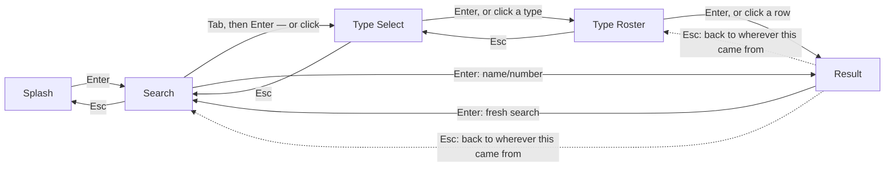

#  pokedex-go 

A terminal Pokédex. Launch it, press Enter, then either type a Pokémon's
name or National Dex Number, or browse by type, and see its sprite and
stats rendered in your terminal, styled after the Pokédex screens from the
Generation 1 Game Boy games.

Built in Go with [Bubble Tea](https://github.com/charmbracelet/bubbletea),
backed by the public [PokeAPI](https://pokeapi.co/).

For the project's vocabulary (Splash Screen, Search Screen, Type Select
Screen, Type Roster Screen, Result Screen, National Dex Number, Lookup
Error vs. Service Error, etc.), see [CONTEXT.md](./CONTEXT.md).


## Features

- **Splash Screen** — a hand-crafted ASCII/ANSI "POKEDEX" logo, embedded in
  the binary.
- **Search by name or number** — type a Pokémon's name (`pikachu`, `Mr Mime`,
  `farfetch'd`, `nidoran♀`) or its National Dex Number (`25`). Input is
  normalized automatically to match PokeAPI's expected format.
- **Search by Type** — a button beneath the search box opens the Type
  Select Screen: all 18 Pokémon types, color-coded the same way as the
  Result Screen's type badges. Picking one opens its Type Roster Screen — a
  scrollable table of every real Pokémon of that type, in National Dex
  Number order, with its generation where known — and selecting a row opens
  that Pokémon's Result Screen, same as a direct name/number search.
- **Result Screen** — the Pokémon's sprite, rendered as colored terminal
  block art, plus a Gen-1-styled stat block: Pokédex #, name, type badges
  (color-coded per type), height and weight in imperial units (matching the
  original English games), and base stats (HP, Attack, Defense, Sp. Atk,
  Sp. Def, Speed).
- **Keyboard and mouse** — every screen is fully keyboard-driven, and where
  your terminal reports mouse events, the same actions (clicking the Search
  by Type button, a type, a Pokémon row, or scrolling the roster) work with
  the mouse too — never one or the other.
- **Distinct error handling** — a bad or unknown name/number shows a
  _Lookup Error_ inline; a PokeAPI outage or timeout shows a distinguishable
  _Service Error_ instead, so you know whether retrying will help.
- **Graceful color degradation** — colors automatically adapt to your
  terminal's capabilities (truecolor, 256-color, or none).

## Controls

| Screen      | Keys                                                                                     |
| ----------- | ----------------------------------------------------------------------------------------- |
| Splash      | `Enter` search · `Q` / `Esc` / `Ctrl+C` quit                                              |
| Search      | `Enter` search · `Tab` switch to the Search by Type button · `Esc` back · `Ctrl+C` quit   |
| Type Select | `↑`/`↓` browse · `Enter` select a type · `Esc` back · `Ctrl+C` quit                       |
| Type Roster | `↑`/`↓` scroll · `Enter` select a Pokémon · `Esc` back · `Ctrl+C` quit                    |
| Result      | `Enter` search again · `Esc` back · `Q` / `Ctrl+C` quit                                   |

Mouse: click the Search by Type button, click a type or a Pokémon row, and
scroll the wheel on the Type Roster's table — all work wherever your
terminal reports mouse events.

(On the Search Screen, only `Ctrl+C` quits — a bare `Q` stays typeable, since
plenty of Pokémon names contain it, e.g. Squirtle. On the Result Screen,
`Esc` returns to wherever you came from — the Search Screen, or the Type
Roster Screen if that's how you got here — while `Enter` always starts a
fresh search; see [Architecture](#architecture).)

## Requirements

- Go 1.26 or later (matches the `.devcontainer` image)
- Network access to `pokeapi.co` to look up Pokémon at runtime

## Development setup

```sh
git clone https://github.com/leekli/pokedex-go.git
cd pokedex-go
go build ./...
```

No further setup is needed — there are no API keys, config files, or
external services beyond PokeAPI itself. The `.devcontainer/` config
provisions a matching Go environment automatically if you're using VS Code
Dev Containers / GitHub Codespaces.

### Running the app

```sh
go run ./cmd/pokedex-go
```

### Building the app

```sh
go build ./cmd/pokedex-go
```

## Testing

The project has three layers of automated tests, plus one opt-in live check
against the real PokeAPI. None of the default tests touch the network.

```sh
# Everything (unit + integration + e2e):
go test ./...

# With coverage:
go test ./... -cover

# Just the pure domain logic (internal/pokemon) and sprite renderer
# (internal/spriteart) — fast, no HTTP involved at all:
go test ./internal/pokemon/... ./internal/spriteart/...

# Just the PokeAPI client, against a local httptest mock server:
go test ./internal/pokeapi/...

# Just the Bubble Tea models in isolation (Update/View for Splash, Search,
# Type Select, Type Roster, Result, and App) plus the pure helpers behind
# them (the startup sweep's color math, lookupCmd/loadTypeRosterCmd's
# PokeAPI orchestration, mouse zone hit-testing):
go test ./internal/tui/...

# Just the full-flow TUI tests (splash → search → result, quitting,
# error paths), driven via Bubble Tea's teatest against a local mock:
go test ./test/e2e/...
```

### Coverage

`internal/pokemon`, `internal/spriteart`, and `internal/pokeapi` sit at
100% statement coverage on their own. `internal/tui` reports ~93% from its
own unit tests (`go test ./internal/tui/... -cover`); the remaining lines —
mostly `App`/screen-model `Update` branches that only fire mid-animation or
mid-lookup — are exercised by `test/e2e`'s full-flow runs instead of being
duplicated at the unit level. Combined
(`go test -coverpkg=./internal/... ./...`), the suite reaches 100% of
`internal/...` statements.

Mouse hit-testing (the Search by Type button, the Type Select list, the
Type Roster's scroll wheel) is unit-tested directly against a real
`*zone.Manager` (see `internal/tui/zones.go`), same layer as everything
else in `internal/tui` — no separate mouse-specific test tooling.

Every file under `internal/tui/` (including `splash.go` and
`splash_legend.go`) has direct unit-test coverage of its pure
logic — `sweepProgress`, `Update`'s key/tick handling, `blendHex`,
`sweepColor`, `hexRGB`, `lerpByte`, `widestLine`. What's *not* re-tested at
the unit level is pixel-exact ANSI output (`renderSplashArtSweep`'s styled
string, lipgloss table borders, etc.) — those are covered by `test/e2e`
asserting on the substrings that matter (e.g. `"POKÉDEX SEARCH"`, a
Pokémon's stat block) against a real terminal-sized render, which is a
better tool for "does the screen show the right thing" than pinning exact
ANSI escape sequences in a unit test would be.

`cmd/pokedex-go/main.go` (0% coverage) is intentionally excluded: it's a
five-line entrypoint that wires an already-tested `pokeapi.Client` into an
already-tested `tui.App` and hands both to Bubble Tea's `Program.Run()` —
there's no branching logic of its own to test, and exercising it would mean
driving a real OS terminal program rather than testing this app's code.

### Live smoke test (opt-in, not part of the default suite)

One additional test hits the _real_ PokeAPI once, to catch drift between the
mocked fixtures used everywhere else and PokeAPI's actual response shape.
It's excluded from normal builds and test runs by a `live` build tag and a
runtime environment-variable check, so it never runs by accident:

```sh
POKEDEX_LIVE_TEST=1 go test -tags=live ./test/live/...
```

## Architecture

pokedex-go follows Bubble Tea's [Elm Architecture](https://github.com/charmbracelet/bubbletea#tutorial):
a single root `Model` (`tui.App`) receives each event as a `Msg` — a
keypress, a mouse click, or a PokeAPI response arriving — its `Update`
returns a new `Model` plus an optional `Cmd` (an async side effect, e.g. a
PokeAPI call), and `View` renders the current `Model` to a string every
cycle. There's no shared mutable state — every screen transition and
network result flows through this `Msg → Update → Cmd → Msg` loop, driven
from `cmd/pokedex-go/main.go`, which just wires a `pokeapi.Client` into a
`tui.App` and hands both to Bubble Tea.

Layering is strict and one-directional: `internal/tui` is the only package
that imports Bubble Tea, and `internal/pokeapi` is the only package that
performs network I/O. Both build on `internal/pokemon` — pure query/name
parsing, unit conversion, type colors, and the `StatBlock` type, with no
knowledge of the TUI or the network. `internal/spriteart` (image → ANSI
block art) is likewise pure, used only by `tui` to render a fetched sprite
— see [Project layout](#project-layout) below. Mouse support is layered on
the same way: [bubblezone](https://github.com/lrstanley/bubblezone) tags
clickable regions (the Search by Type button, a type, a Pokémon row) as
they're rendered, and `App.View` resolves them once at the root — every
screen still works keyboard-only if a click never arrives.

`App` doesn't hardcode each screen's "go back" destination; it keeps a
navigation history stack instead, so Esc always returns to whichever screen
led to the current one, however deep the path — see
[`docs/adr/0001`](./docs/adr/0001-navigation-history-for-back-navigation.md).
The one exception is the Result Screen's Enter, which always means "search
again" and resets straight back to the Search Screen regardless of history.



Both paths into the Result Screen end up calling the same
`pokeapi.Client.Lookup`: a National Dex Number resolves via `GetSpecies` →
`GetPokemon`, a name (typed, or picked off a Type Roster row) calls
`GetPokemon` directly. Any failure is classified as a `*LookupError` (bad
input) or `*ServiceError` (PokeAPI's fault) — see CONTEXT.md. A failed
sprite fetch doesn't fail the whole lookup; the Result Screen just falls
back to a "no sprite" message.

The Type Roster Screen's own data comes from `Client.GetPokemonByType`
(PokeAPI's `/type/{name}`, filtered down to real, dex-numbered Pokémon —
see [`docs/adr/0002`](./docs/adr/0002-filter-type-roster-by-pokemon-id.md))
plus `Client.GetGenerationIndex`, a nine-request, best-effort map built
once and cached for the rest of the session rather than refetched on every
type selected.

## Project layout

```
cmd/pokedex-go/       entrypoint - wires everything together and runs the program
internal/pokemon/     pure domain logic: input normalization, unit conversion, type colors, generations
internal/pokeapi/     PokeAPI HTTP client, JSON decoding, Lookup/Service error classification
internal/spriteart/   renders a decoded image as colored terminal block art
internal/tui/         Bubble Tea layer: Splash, Search, Type Select, Type Roster, and Result screens
test/e2e/              full-flow tests driven through the TUI via teatest
test/live/             opt-in live smoke test against the real PokeAPI
docs/adr/              architecture decision records — the "why" behind hard-to-reverse choices
CONTEXT.md            domain glossary — the project's vocabulary
```
